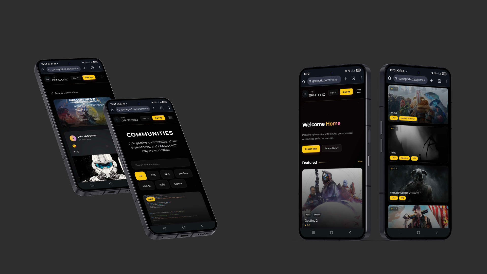
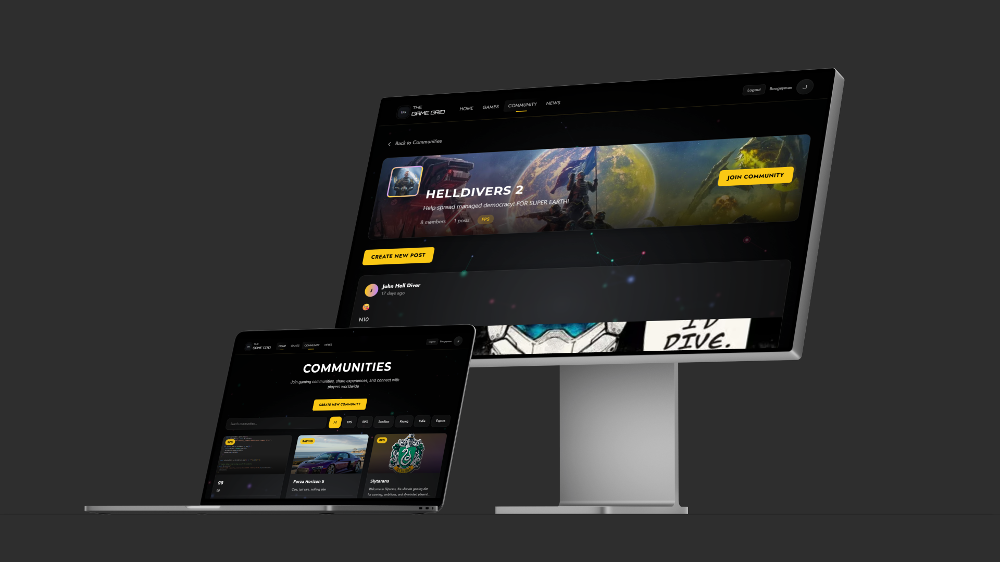

# David Golding

Double major in Interactive Development and User Experience Design  
Open Window Institute

I like solving real problems, building systems, and creating interfaces that follow the “rule of cool” without sacrificing usability. My work balances strong visuals with clarity, practicality, and a solid understanding of the audience.

I am comfortable experimenting, testing, and iterating. I do the research, try new approaches, and refine until the solution is both effective and maintainable.

---

## About Me

I work at the intersection of development and user experience. My background combines:

- Interactive development and frontend engineering
- User experience design and research
- System thinking and structured problem solving

I care about:

- Code that is understandable, not just “clever”
- Interfaces that stay usable under pressure, not only in ideal scenarios
- Design decisions based on context, constraints, and the people using the product

---

## Development Approach

- User-centred thinking: features are driven by real needs, not just what is easy to code.
- Systemic thinking: I look at flows, edge cases, and how parts interact, not just individual screens.
- Iteration and validation: I prefer to prototype, test, and adjust rather than assume I am right the first time.
- Practical experimentation: I am not afraid to explore new tools and patterns, as long as the end result is stable and understandable.

---

## Tech Stack

### Frontend Development

### Backend and Databases

### Design and UX

### Other Experience

---

## Featured Work

My projects focus on combining solid engineering with intentional UX. Pinned repositories on my profile highlight:

- React.js applications using component-based architecture and clean state management
- Full stack development with frontend and backend integrated into coherent systems
- Database design with MySQL, including schema design and query efficiency
- UX design and research integrated into the development cycle, not tacked on at the end
- End-to-end deployments, including fully deployed solutions on AWS

---

## Featured Work

Below are three representative projects with UI mockups.

---

### Billionaires E-commerce Site

**Key screens**

  

---

### ThunderStats

**Key screens**

  

---

### GameGrid GG

**Key screens**

  
  

---

## Current Focus

Right now I am focused on:

- Deepening my understanding of my previous work to refine patterns that actually hold up over time
- Exploring better ways to structure and organise code for clarity and reuse
- Improving efficiency in how I approach features, from concept to deployment
- Strengthening full stack workflows, from UX thinking through to production deployment

---

## Contact

If you want to discuss a project, idea, or collaboration, email is the best way to reach me.

You can also contact me directly at: `dgolding237work@gmail.com`

## Portfolio

You can view a selection of my work to show cases my UX and Development works along with my 3D Designs and Game Development:

Direct link: https://a2002384d1a.myportfolio.com
---

