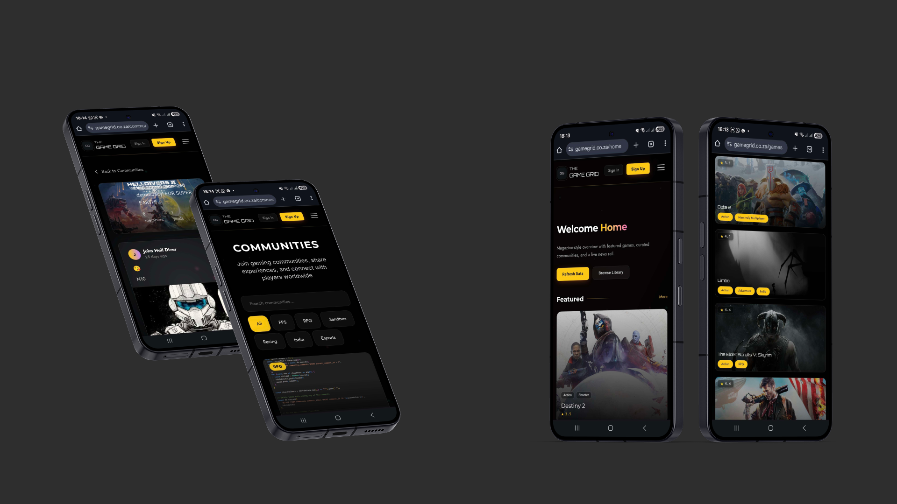
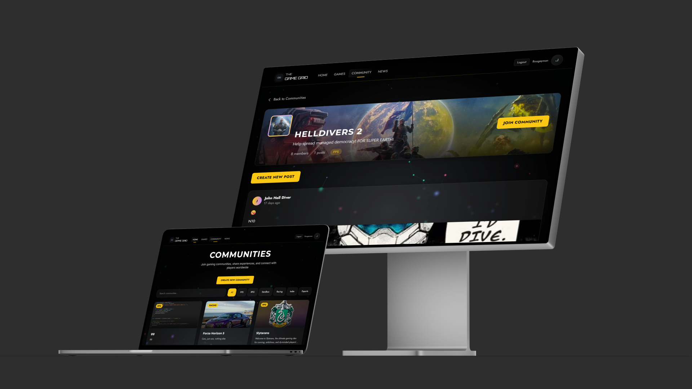

# David Golding

Double major in Interactive Development and User Experience Design  
Open Window Institute · Third year

I like solving real problems, building systems, and creating interfaces that follow the “rule of cool” without sacrificing usability. My work balances strong visuals with clarity, practicality, and a solid understanding of the audience.

I am comfortable experimenting, testing, and iterating. I do the research, try new approaches, and refine until the solution is both effective and maintainable.

---

## About Me

I work at the intersection of development and user experience. My background combines:

- Interactive development and frontend engineering
- User experience design and research
- System thinking and structured problem solving

I care about:

- Code that is understandable, not just “clever”
- Interfaces that stay usable under pressure, not only in ideal scenarios
- Design decisions based on context, constraints, and the people using the product

---

## Development Approach

- User-centred thinking: features are driven by real needs, not just what is easy to code.
- Systemic thinking: I look at flows, edge cases, and how parts interact, not just individual screens.
- Iteration and validation: I prefer to prototype, test, and adjust rather than assume I am right the first time.
- Practical experimentation: I am not afraid to explore new tools and patterns, as long as the end result is stable and understandable.

---

## Tech Stack

### Frontend Development

### Mobile

### Backend and Databases

### Design and UX

### Other Experience

---

## Featured Work · Third Year

My third-year projects focus on combining solid engineering with intentional UX. These are the pieces I want reviewed first.

---

<h2 align="center">
  
  &nbsp;Doomagotchi
</h2>

<strong>A digital pet that dies when you doomscroll.</strong>

Screen time apps show you a number and hope you care. Doomagotchi makes the cost feel real. You pick a pet. You name it. Then your actual Instagram, TikTok, YouTube, X and the rest start eating its health. Stay under the limit and it recovers. Keep scrolling and it gets sick. Hit zero and it goes to the Graveyard with an epitaph.

Built for Android with Expo, React Native and TypeScript. Firebase for accounts and pet data. Real usage stats from the phone, not fake sliders. Background tasks keep the pet alive or dying even when the app is closed. Challenges and badges lock in sequence so you actually have to earn them.

<h3 align="center">Meet the pets</h3>

<table align="center" bgcolor="#ffffff">
  <tr>
    <td align="center" width="180" bgcolor="#ffffff">
      
       
      <strong>Nugget</strong>
    </td>
    <td align="center" width="180" bgcolor="#ffffff">
      
       
      <strong>Waddles</strong>
    </td>
    <td align="center" width="180" bgcolor="#ffffff">
      
       
      <strong>Spino</strong>
    </td>
  </tr>
</table>

Each one has happy, sick and dead states. You do not get a revive button. That was the point.

<h3 align="center">Key screens</h3>

  
  

  
  

Repo: <a href="https://github.com/DavidGolding200238/Doomagotchi">Doomagotchi</a>

---

### Arkane Aid

Spoken D&D table aid for Android. Expo and React Native, with expo-speech, custom navigation, and a themed interface built for use at the table.

Screenshots coming soon.

---

<h2 align="center">Projello</h2>

  

<strong>Lightweight project management, built for people who work on site.</strong>

Most PM tools are bloated office software pretending they belong on a construction site. Projello was built the other way around. A real client, William Basson, runs multiple teams and physical sites at once. He needed something fast enough for a foreman with dusty hands, not another enterprise dashboard.

Team Cepression made it for Interactive Development 300. Sage green on purpose, so it still reads in harsh outdoor light. Hierarchy is project, milestone, task. Workers check in. Photos prove the work happened. Clients see what they are allowed to see. Calls run through SignalR and WebRTC so the office and the site stay on the same page.

React and TypeScript inside Electron. ASP.NET Core and C# on the API. PostgreSQL, JWT, two factor auth, Docker.

<h3 align="center">Key screens</h3>

  
  

Repo: <a href="https://github.com/AngievR05/Projello-Management-System">Projello</a>

---

## Year Two Work

Foundation projects. Full-stack web, dashboards, and UX-led product work that led into the third-year build.

---

### GameGrid GG

**Key screens**

  
  

---

### ThunderStats

**Key screens**

  

---

### Billionaires E-commerce Site

**Key screens**

  

---

## Current Focus

Right now I am focused on:

- Deepening my understanding of my previous work to refine patterns that actually hold up over time
- Exploring better ways to structure and organise code for clarity and reuse
- Improving efficiency in how I approach features, from concept to deployment
- Strengthening full stack workflows, from UX thinking through to production deployment

---

## Contact

If you want to discuss a project, idea, or collaboration, email is the best way to reach me.

You can also contact me directly at: `dgolding237work@gmail.com`

## Portfolio

You can view a selection of my work to show cases my UX and Development works along with my 3D Designs and Game Development:

---

